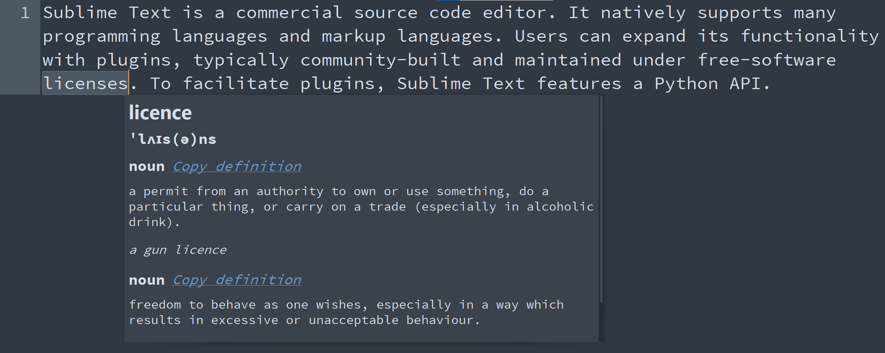
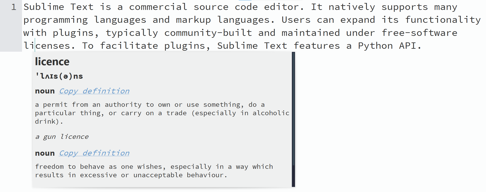

# 📔 Dictionary

[Dictionary](https://github.com/futureprogrammer360/Dictionary) is a convenient [Sublime Text](https://www.sublimetext.com/) plugin that shows detailed definitions of words, including phonetics, parts-of-speech, definitions, and examples.

## 🎬 Demonstration




## 💻 Installation

The easiest way to install Dictionary is through [Package Control](https://packagecontrol.io/packages/Dictionary). After it is enabled inside Sublime Text, open the command palette and find **Package Control: Install Package** and press `ENTER`. Then, find **Dictionary** in the list. Press `ENTER` again, and this plugin is installed!

## 📈 Usage

The plugin includes the command `dictionary_define`, which can be run in the command palette as `Dictionary: Define`.

**To see the definition of a word:**

* Click on or select that word
* Run the `Dictionary: Define` command in the command palette or run the command with custom keybindings (see below)
* Read and/or copy the definition on the popup

## ⚙ Customization

The Dictionary plugin is fully customizable.

### 🔧 Preferences

There are several settings in `Dictionary.sublime-settings` that you can change to make Dictionary work as you want. The file can be accessed via the `Preferences: Dictionary` command in the command palette.

#### Hover mode

When `hover_mode` is set to `true` in settings, definitions of text under mouse will be shown on hover without having to run a command.

Hover mode can also be toggled via the `Dictionary: Toggle Hover Mode` (`dictionary_toggle_hover_mode`) command in the command palette.

#### Number of definitions

The `num_definitions` setting configures the maximum number of definitions to display. Set it to `null` (the default value) to see all available definitions. Set it to `0` to see only the word and phonetic pronunciation.

### ⌨ Keybindings

Custom keybindings can be created for the commands.

* Run the `Preferences: Dictionary Key Bindings` command in the command palette.
* Add your keybindings!

Below is an example of the keybinding file:

```json
[
    {
        "keys": ["ctrl+alt+d"],
        "command": "dictionary_define"
    }
]
```

## Acknowledgment

This plugin is made possible by the [Free Dictionary API](https://dictionaryapi.dev/), which is used for the definitions.
